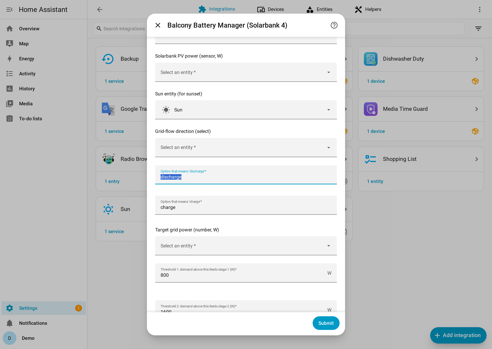
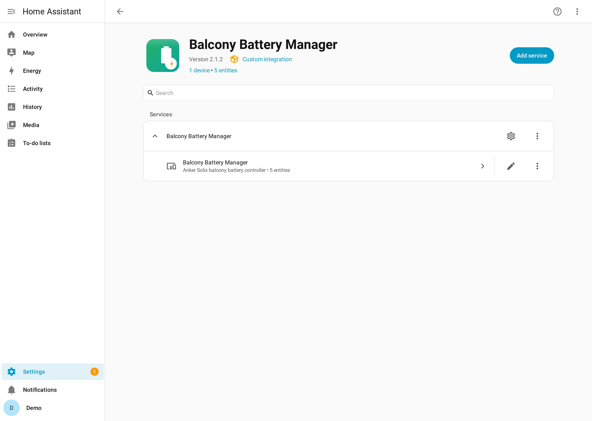
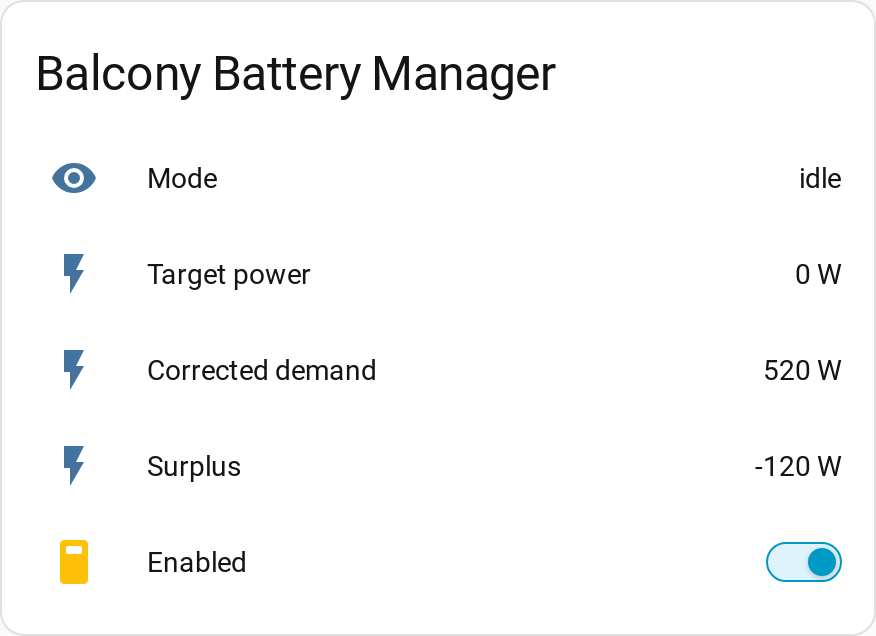

# Balcony Battery Manager

Automatically control an **Anker SOLIX Solarbank 4 (E5000 Pro)** plug-in / "balcony" battery from Home Assistant signals — demand-aware discharge support and predictive PV-surplus charging, driven entirely by local entities you pick.

[](https://hacs.xyz)
[](https://github.com/Jo-Highness/balcony_battery_manager/actions/workflows/validate.yml)
[](https://github.com/Jo-Highness/balcony_battery_manager/actions/workflows/test.yml)
[](https://github.com/Jo-Highness/balcony_battery_manager/releases)
[](LICENSE)
[](https://www.home-assistant.io)

> **This integration drives real hardware.** It repeatedly writes power setpoints
> and a charge/discharge direction to your Solarbank. Correct behaviour depends
> entirely on you selecting the right entities and getting the sign conventions
> right. Read the [Requirements](#requirements--prerequisites) and
> [Configuration](#configuration) sections before enabling it.

---

## Table of contents

- [Why this exists](#why-this-exists)
- [Requirements / Prerequisites](#requirements--prerequisites)
- [Screenshots](#screenshots)
- [Installation](#installation)
- [Configuration](#configuration)
- [Entities](#entities)
- [Services](#services)
- [Automation examples](#automation-examples)
- [How it behaves](#how-it-behaves)
- [Troubleshooting / FAQ](#troubleshooting--faq)
- [Contributing](#contributing)
- [License](#license)
- [Credits](#credits)

---

## Why this exists

The goal is to safely automate an Anker SOLIX Solarbank 4 balcony battery from
signals you already have in Home Assistant — house power flows, grid power, the
Solarbank's own state of charge and PV power — so the battery relieves your main
house battery when demand is high and tops itself up from PV surplus when there
is spare solar to harvest.

**This is not an Anker cloud integration.** It has no external API, no cloud
account, and no API key. Everything is local and driven by Home Assistant
entities you select. The integration does **not** talk to the Solarbank
directly — it steers it through the Solarbank's own "third-party control" actor
entities, which a *separate* Anker Solix integration must expose (a **select**
for the charge/discharge grid-flow direction and a **number** for the target
grid power). Each control cycle the integration reads the live signals, decides
exactly one mode, and writes the setpoints to those two actors.

---

## Requirements / Prerequisites

- **Home Assistant 2024.12.0 or newer.**
- A **third-party Anker Solix integration** that exposes the Solarbank 4's
  "third-party control" entities — specifically:
  - a **grid-flow direction** entity of type `select` (or `input_select`), whose
    options include one that means *discharge* and one that means *charge*, and
  - a **target grid power** entity of type `number` (or `input_number`), in watts.

  Such an integration is, for example, the community `anker_solix` project or an
  `anker_solix_official` variant. This project depends only on the two actor
  entities described above being available in Home Assistant — however you obtain
  them. Set the Solarbank's operating mode to third-party control so those
  entities become writable.
- The measurement entities you want the controller to read (see
  [Inputs](#inputs) below). These come from your meter, your Solarbank
  integration and `sun.sun`.

### ⚠️ Breaking change in v2 — no migration from v1

Version **2.0.0** rewrote the integration for the Solarbank **4**; earlier
versions targeted the Solarbank **3** with a different actor model and an
incompatible option set. **Old (v1) config entries cannot be migrated.** On
upgrade the old entry is deliberately rejected (`async_migrate_entry` returns
`False`, logged as a migration error). To move to v2 you must **remove the old
Balcony Battery Manager integration and add it again** to reconfigure it for the
Solarbank 4.

---

## Screenshots

> Captured from a demo Home Assistant with fictional data.

| Config flow | Entities | Dashboard |
|---|---|---|
|  |  |  |

---

## Installation

### HACS (recommended)

[](https://my.home-assistant.io/redirect/hacs_repository/?owner=Jo-Highness&repository=balcony_battery_manager&category=integration)

1. Click the **Open in HACS** button above (or, in HACS, add
   `https://github.com/Jo-Highness/balcony_battery_manager` as a custom
   repository of category *Integration*).
2. Install **Balcony Battery Manager**.
3. Restart Home Assistant.
4. Go to **Settings → Devices & Services → Add Integration** and search for
   **Balcony Battery Manager**.

### Manual

1. Copy `custom_components/balcony_battery_manager` into your Home Assistant
   `config/custom_components/` directory.
2. Restart Home Assistant.
3. Add the integration via **Settings → Devices & Services → Add Integration →
   Balcony Battery Manager**.

---

## Configuration

Configuration is done entirely through the UI — there is **no YAML**. Setup is a
single-step form. It ships with **vendor-aware prefill** that suggests sensible
defaults for common setups; review the suggestions and adjust them to your
installation before saving.

Every parameter is also editable later via the integration's **Configure**
(Options) button; saving new options reloads the entry.

The parameters below are grouped for readability; on the form they appear in one
list. "Default" is the suggested value where the integration provides one.

### Inputs

Measurement entities the controller reads.

| Parameter | Type | Default | Description |
|---|---|---|---|
| Main-battery draw into house | `sensor` | — | Power your main house battery delivers into the house. |
| Positive value = discharge into house | boolean | On | Sign flag for the entry above; turn off if your sensor is negative when discharging. |
| Solarbank feed-in to house | `sensor` | — | Power the Solarbank currently feeds into the house (W). |
| Grid power | `sensor` | — | Grid meter power. |
| Positive value = export to grid | boolean | On | Sign flag for grid power; turn off if your sensor is negative when exporting. |
| Solarbank state of charge | `sensor` | — | Solarbank SoC in %. |
| Solarbank PV power | `sensor` | — | Solarbank PV production in W. |
| Sun entity | `sun` | `sun.sun` | Used for sunset timing in the charge forecast. |
| Main-battery state of charge | `sensor` | — | *Optional.* Enables [grid support](#grid-support) when set. |

### Actors

The Solarbank's third-party-control entities the controller writes to.

| Parameter | Type | Default | Description |
|---|---|---|---|
| Grid-flow direction | `select` / `input_select` | — | Selects charge vs. discharge direction. |
| Option that means "discharge" | text | `discharge` | The select option value to use for discharging. |
| Option that means "charge" | text | `charge` | The select option value to use for charging. |
| Target grid power | `number` / `input_number` | — | Target grid power setpoint (W). Written values are clamped to this entity's own min/max. |

### Discharge staircase

Two-step discharge support against the corrected house demand, with a dwell time
and an anti-flap hysteresis band.

| Parameter | Default | Description |
|---|---|---|
| Threshold 1 | 800 W | Demand above this feeds at least stage 1. |
| Threshold 2 | 1600 W | Demand above this feeds stage 2. |
| Stage 1 feed-in | 350 W | Feed-in power for stage 1. |
| Stage 2 feed-in | 800 W | Feed-in power for stage 2. |
| Dwell time | 10 min | The condition must hold continuously for this long before the stage changes. |
| Hysteresis | 100 W | Anti-flap band around the thresholds. |

### Charging

Predictive PV-surplus charging: charge only when the Solarbank is not expected
to reach its target from PV alone before sunset.

| Parameter | Default | Description |
|---|---|---|
| Maximum charge power | 2500 W | Upper bound on charge power. |
| Export reserve | 100 W | Export kept back while charging. |
| Target SoC | 100 % | Charge goal. |
| Usable battery capacity | 15.5 kWh | Used to compute the energy still needed. |
| PV nominal power | 2000 W | Solarbank PV nominal, used in the remaining-PV estimate. |
| Afternoon cap boundary | 13 (hour) | From this hour, the PV estimate is capped. |
| Afternoon cap factor | ~0.33 (1/3) | Cap = PV nominal × this factor after the boundary hour. |

### Grid support

When the main house battery is empty, cover the house from the Solarbank minus a
small margin. Requires the optional **Main-battery state of charge** input; if it
is not set, grid support stays off.

| Parameter | Default | Description |
|---|---|---|
| Grid support enabled | On | Master toggle for this mode. |
| Main battery counts as empty at/below | 10 % | Threshold at which grid support engages. |
| SoC hysteresis to release | 3 % | SoC must rise this far above the empty threshold to release. |
| Residual grid import to keep | 100 W | The margin left to the grid while supporting. |
| Maximum feed-in during grid support | 800 W | Upper bound on grid-support feed-in. |
| Solarbank minimum SoC to discharge | 10 % | Solarbank must stay above this to discharge. |

### General

| Parameter | Default | Range | Description |
|---|---|---|---|
| Control interval | 30 s | 5–600 s | How often the control loop runs. |
| Deadband | 25 W | 0–500 W | Minimum setpoint change before the actuator is rewritten. |

> **Sign conventions matter.** Each signed input (main-battery draw, grid power)
> has a "positive =" toggle. If the corrected demand comes out negated — e.g. the
> battery never feeds in when it should — check these flags against how your
> sensors report sign.

---

## Entities

All entities belong to a single device **Balcony Battery Manager** (manufacturer
*Balcony Battery Manager*, model *Anker Solix balcony battery controller*) and use
`has_entity_name`.

| Entity | Platform | Details |
|---|---|---|
| **Mode** | `sensor` | Current mode: `idle` / `discharge` / `charge` / `failsafe` / `disabled`. Attributes: `grid_flow`, `charge_release`, `need_wh`, `rest_pv_wh`, `reason`. |
| **Target power** | `sensor` | Written setpoint in W (device class `power`). |
| **Corrected demand** | `sensor` | Reconstructed house demand in W (device class `power`). |
| **Surplus** | `sensor` | Live surplus in W (device class `power`). |
| **Enabled** | `switch` | Master switch (config category) that turns the control loop on and off. |

---

## Services

| Service | Description |
|---|---|
| `balcony_battery_manager.enable` | Enable the control loop and run one calculation immediately. |
| `balcony_battery_manager.disable` | Disable the control loop and run the configured deactivation action (set feed-in and charging to 0). |
| `balcony_battery_manager.recalculate_now` | Trigger an immediate control cycle, outside the regular interval. |

---

## Automation examples

### Notify when the controller enters fail-safe

```yaml
alias: Balcony battery – notify on failsafe
trigger:
  - platform: state
    entity_id: sensor.balcony_battery_manager_mode
    to: "failsafe"
action:
  - service: notify.persistent_notification
    data:
      title: Balcony Battery Manager
      message: >-
        Controller went to fail-safe (a required sensor is unavailable);
        feed-in and charging were set to 0 W.
```

### Disable the controller at night, re-enable at sunrise

```yaml
alias: Balcony battery – off at night
trigger:
  - platform: sun
    event: sunset
    offset: "+00:30:00"
action:
  - service: balcony_battery_manager.disable
mode: single

---

alias: Balcony battery – on at sunrise
trigger:
  - platform: sun
    event: sunrise
action:
  - service: balcony_battery_manager.enable
mode: single
```

---

## How it behaves

- **Control loop.** A single coordinator runs on the configured control interval
  (default 30 s). Each cycle it reads the live signals, decides exactly one mode,
  and writes the setpoints to the actor entities.
- **Fail-safe.** If any required sensor (main-battery draw, Solarbank feed-in,
  grid power, Solarbank SoC, Solarbank PV) is unavailable, the controller fails
  safe: it sets the target power to **0 W** and reports mode `failsafe`.
- **Deadband.** The target-power number is only rewritten when the setpoint
  changes by at least the deadband (or the flow direction changes), so tiny
  fluctuations don't churn the actuator. Written values are also clamped to the
  number entity's own min/max.
- **Disable action.** Turning the master switch off, or calling
  `balcony_battery_manager.disable`, runs the deactivation action (setpoints to
  0) and reports mode `disabled` until re-enabled.
- **Options reload.** Changing any option via **Configure** reloads the config
  entry so the new parameters take effect.

---

## Troubleshooting / FAQ

**The battery never feeds in even under high load.**
Check the sign flags (*Positive value = discharge into house*, *Positive value =
export to grid*) against how your sensors actually report. If the corrected
demand sensor reads negative when the house is drawing power, a sign flag is
wrong.

**Mode stays `failsafe`.**
One of the required sensors is `unavailable` / `unknown`. Confirm all of the
main-battery draw, Solarbank feed-in, grid power, Solarbank SoC and Solarbank PV
entities have valid numeric states.

**Grid support never engages.**
Grid support requires the optional **Main-battery state of charge** input to be
configured, *Grid support enabled* to be on, and the main-battery SoC to be
at/below the empty threshold while the Solarbank stays above its minimum SoC.

**I upgraded and the integration is gone / errored.**
That is the intended v2 breaking behaviour — see
[Breaking change in v2](#️-breaking-change-in-v2--no-migration-from-v1). Remove
the old entry and add the integration again.

**Enable debug logging.**

```yaml
logger:
  logs:
    custom_components.balcony_battery_manager: debug
```

---

## Contributing

Issues and pull requests are welcome. Please see
[`CONTRIBUTING.md`](CONTRIBUTING.md) for guidelines.

---

## License

Released under the [MIT License](LICENSE).

---

## Credits

- The Anker Solix community integration effort, which exposes the Solarbank's
  third-party-control actor entities this integration depends on.
- The [Home Assistant](https://www.home-assistant.io) project.
